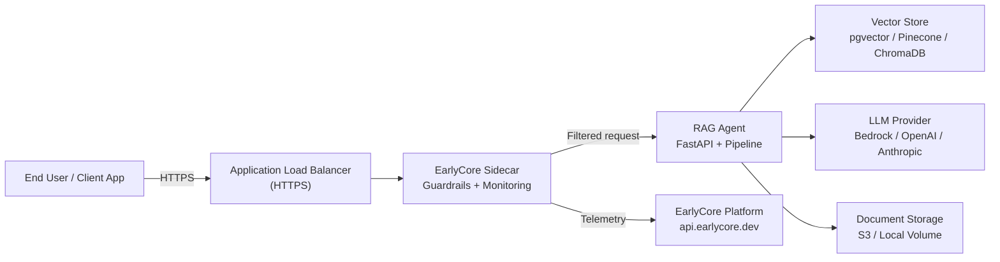
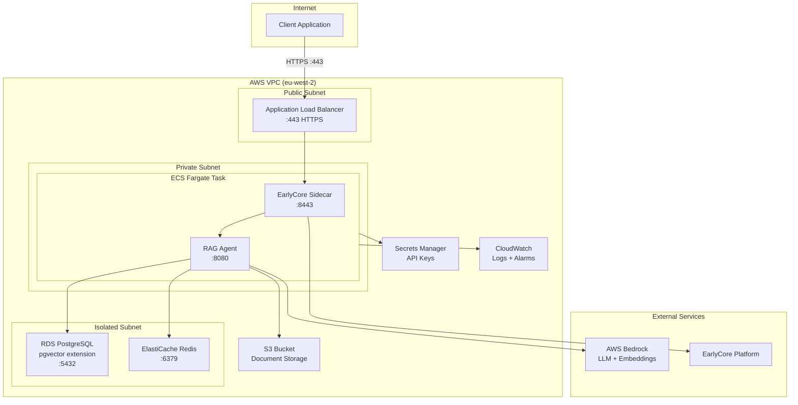
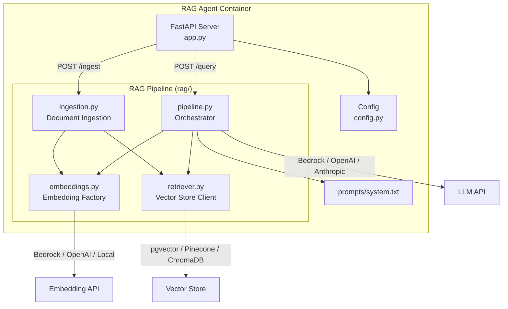
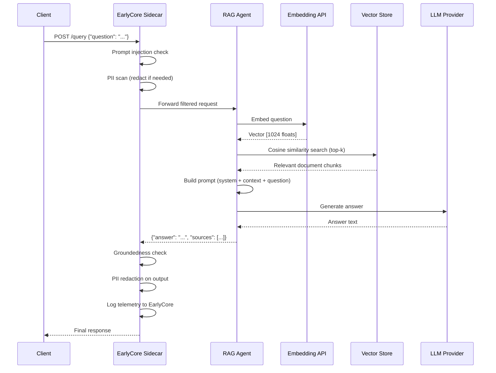
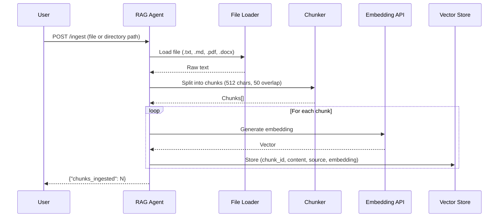
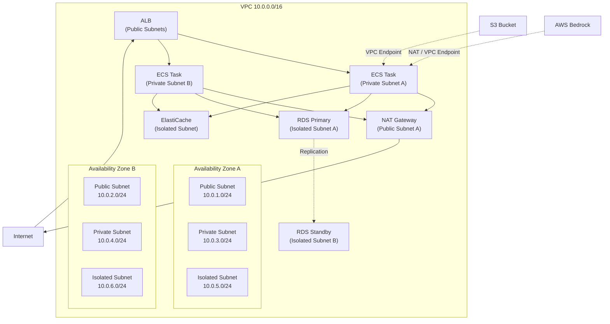

# System Architecture

This document describes the architecture of your EarlyCore RAG agent at three levels of detail, following the C4 model.

______________________________________________________________________

## System Context (C4 Level 1)

How the RAG agent fits into the broader environment.

| Component              | Responsibility                                                              |
| ---------------------- | --------------------------------------------------------------------------- |
| **End User**           | Sends questions via HTTPS POST to `/query`                                  |
| **ALB**                | TLS termination, health checks, request routing (AWS only)                  |
| **EarlyCore Sidecar**  | Prompt injection detection, PII redaction, groundedness checking, telemetry |
| **RAG Agent**          | Embeds the question, retrieves documents, generates an answer               |
| **Vector Store**       | Stores and retrieves document embeddings                                    |
| **LLM Provider**       | Generates natural-language answers from context + question                  |
| **EarlyCore Platform** | Aggregates monitoring data, triggers alerts, provides the dashboard         |
| **Document Storage**   | Holds source documents for ingestion                                        |

______________________________________________________________________

## Container Diagram (C4 Level 2)

What runs inside the deployment.

### Local Development Equivalent

In local development (`docker compose`), the same containers run without the AWS wrapper:

| AWS Service       | Local Equivalent                   |
| ----------------- | ---------------------------------- |
| ALB               | Direct port mapping `:8443`        |
| ECS Fargate       | Docker Compose services            |
| RDS PostgreSQL    | `pgvector/pgvector:pg16` container |
| ElastiCache Redis | `redis:7-alpine` container         |
| S3                | Local volume mount                 |
| Secrets Manager   | `.env` file                        |
| CloudWatch        | `docker compose logs`              |

______________________________________________________________________

## Component Diagram (C4 Level 3)

What happens inside the RAG Agent container.

### File-by-File Reference

| File                       | Purpose                                                                                               |
| -------------------------- | ----------------------------------------------------------------------------------------------------- |
| `agent/app.py`             | FastAPI application with `/health`, `/query`, `/ingest`, `/ingest/directory`, and `/agents` endpoints |
| `agent/config.py`          | Typed configuration loaded from environment variables via pydantic-settings                           |
| `agent/rag/pipeline.py`    | Orchestrates the full RAG flow: embed question, retrieve docs, build prompt, call LLM                 |
| `agent/rag/embeddings.py`  | Embedding factory supporting Bedrock Titan, OpenAI, and local SentenceTransformers                    |
| `agent/rag/retriever.py`   | Vector store client supporting pgvector, Pinecone, and ChromaDB                                       |
| `agent/rag/ingestion.py`   | Document loader, chunker, and storer for `.txt`, `.md`, `.pdf`, `.docx` files                         |
| `agent/prompts/system.txt` | System prompt that defines the agent's personality and behaviour                                      |
| `agent/Dockerfile`         | Non-root, read-only container build                                                                   |
| `agent/requirements.txt`   | Python dependencies                                                                                   |
| `earlycore.yaml`           | Guardrail configuration consumed by the sidecar                                                       |
| `docker-compose.yml`       | Local development orchestration                                                                       |
| `.env.example`             | Template for environment variables                                                                    |
| `infra/aws/template.yaml`  | CloudFormation master stack for production deployment                                                 |

______________________________________________________________________

## Data Flow: Query

Step-by-step path of a user question through the system.

1. **Client** sends a POST request with a `question` field to the sidecar endpoint (`:8443`).
1. **Sidecar** runs input guardrails: injection detection and PII scanning. Blocked requests return a 403 with an explanation.
1. **Agent** receives the filtered request and embeds the question using the configured embedding provider.
1. **Retriever** performs a cosine similarity search against the vector store and returns the top-k most relevant chunks.
1. **Pipeline** assembles a prompt with the system instruction, retrieved context, and the original question.
1. **LLM** generates an answer grounded in the provided context.
1. **Sidecar** checks the output for groundedness and PII before returning it to the client.
1. **Telemetry** (latency, guardrail events, token usage) is sent asynchronously to the EarlyCore platform.

______________________________________________________________________

## Data Flow: Document Ingestion

______________________________________________________________________

## Infrastructure Diagram (AWS Production)

### Network Security

| Subnet Tier  | Inbound                          | Outbound        | Resources         |
| ------------ | -------------------------------- | --------------- | ----------------- |
| **Public**   | HTTPS (443) from internet        | All             | ALB, NAT Gateway  |
| **Private**  | ALB traffic only (8443)          | Via NAT Gateway | ECS Fargate tasks |
| **Isolated** | Private subnet only (5432, 6379) | None            | RDS, ElastiCache  |

### Security Groups

| Security Group | Allows Inbound From | Ports |
| -------------- | ------------------- | ----- |
| ALB SG         | `0.0.0.0/0`         | 443   |
| ECS SG         | ALB SG              | 8443  |
| Database SG    | ECS SG              | 5432  |
| Cache SG       | ECS SG              | 6379  |

______________________________________________________________________

## Security Layers

Where guardrails are applied across the request lifecycle.

```mermaid
graph LR
    subgraph Network["Layer 1: Network"]
        HTTPS["HTTPS Only"]
        VPC["VPC Isolation"]
        SG["Security Groups"]
    end

    subgraph Application["Layer 2: Application"]
        Injection["Injection Detection"]
        PII_In["PII Scan (Input)"]
        PII_Out["PII Redaction (Output)"]
        Ground["Groundedness Check"]
        Topic["Topic Restrictions"]
    end

    subgraph Data["Layer 3: Data"]
        KMS["Encryption at Rest (KMS)"]
        TLS["Encryption in Transit (TLS)"]
    end

    subgraph Container["Layer 4: Container"]
        NonRoot["Non-root User"]
        ReadOnly["Read-only FS"]
        NoPriv["no-new-privileges"]
        Limits["Resource Limits"]
    end

    subgraph Monitoring["Layer 5: Monitoring"]
        EarlyCore["EarlyCore Dashboard"]
        CW["CloudWatch Alarms"]
        Audit["Audit Logging"]
    end

    Network --> Application --> Data --> Container --> Monitoring
```

For full security details, see [Security Architecture](security.md).

______________________________________________________________________

## Deployment Options

| Option                | Infrastructure                     | Best For                    | Guide                                                           |
| --------------------- | ---------------------------------- | --------------------------- | --------------------------------------------------------------- |
| **Local Development** | Docker Compose                     | Development, testing, demos | [Setup Guide - Local](setup-guide.md#path-1-local-development)  |
| **AWS Production**    | CloudFormation (VPC, ECS, RDS, S3) | Production workloads        | [Setup Guide - AWS](setup-guide.md#path-2-aws-production)       |
| **Docker Production** | Docker Compose on a remote server  | Self-hosted production      | [Setup Guide - Docker](setup-guide.md#path-3-docker-production) |
