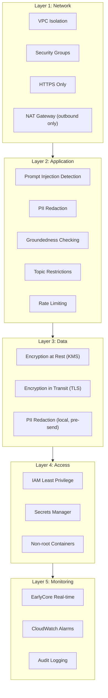
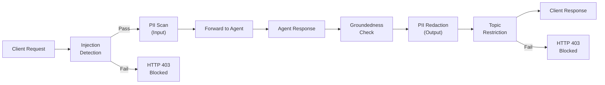

# Security Architecture

Five layers of defence protect your RAG agent from network to application level. Every layer is configured by default -- no security code required in your agent.

______________________________________________________________________

## Defence in Depth Overview



______________________________________________________________________

## Layer 1: Network

All infrastructure runs inside a VPC with three subnet tiers.

| Subnet Tier  | Internet Access       | Resources         | Purpose                               |
| ------------ | --------------------- | ----------------- | ------------------------------------- |
| **Public**   | Inbound + Outbound    | ALB, NAT Gateway  | Accept client traffic, route outbound |
| **Private**  | Outbound via NAT only | ECS Fargate tasks | Run agent + sidecar containers        |
| **Isolated** | None                  | RDS, ElastiCache  | Store data with no internet path      |

### Security Group Rules

| Group    | Inbound From | Ports | Why                                         |
| -------- | ------------ | ----- | ------------------------------------------- |
| ALB      | `0.0.0.0/0`  | 443   | Accept HTTPS from clients                   |
| ECS      | ALB SG only  | 8443  | Only the load balancer can reach containers |
| Database | ECS SG only  | 5432  | Only the agent can reach PostgreSQL         |
| Cache    | ECS SG only  | 6379  | Only the agent can reach Redis              |

### What This Means

- No SSH or RDP access to any resource. Access via CloudWatch Logs or ECS Exec only.
- Databases and caches have zero internet connectivity.
- All outbound traffic (LLM calls, telemetry) routes through the NAT Gateway, which can be monitored and audited.

______________________________________________________________________

## Layer 2: Application (EarlyCore Sidecar)

The sidecar sits between the client and your agent, applying guardrails to every request and response.

### Guardrail Pipeline



### Guardrail Details

| Guardrail                      | What It Does                                                                                | When It Triggers               | What Happens                                                             |
| ------------------------------ | ------------------------------------------------------------------------------------------- | ------------------------------ | ------------------------------------------------------------------------ |
| **Prompt Injection Detection** | Analyses input for jailbreak patterns, role-play attacks, and instruction override attempts | Before forwarding to agent     | Request blocked with HTTP 403. Event logged to EarlyCore.                |
| **PII Redaction (Input)**      | Scans input for names, emails, phone numbers, addresses, government IDs                     | Before forwarding to agent     | PII replaced with `[REDACTED]` tokens. Original never reaches the agent. |
| **Groundedness Check**         | Compares the agent's answer against retrieved source documents                              | After agent generates response | Ungrounded claims flagged in telemetry. Optionally blocked.              |
| **PII Redaction (Output)**     | Scans response for leaked PII from documents                                                | After agent generates response | PII replaced with `[REDACTED]` before reaching the client.               |
| **Topic Restrictions**         | Checks response against forbidden topic list                                                | After agent generates response | Response blocked if it covers a restricted topic.                        |
| **Rate Limiting**              | Limits requests per client IP or API key                                                    | Before any processing          | Excess requests return HTTP 429.                                         |

### Local vs. Platform PII Detection

The `local_pii` setting controls how PII is detected:

| Mode               | `local_pii` | Engine                           | Entities Detected                                        | Latency   | Privacy                                                                    |
| ------------------ | ----------- | -------------------------------- | -------------------------------------------------------- | --------- | -------------------------------------------------------------------------- |
| **Full (default)** | `true`      | Microsoft Presidio (NER + rules) | 50+ entity types including names, addresses, medical IDs | ~50-200ms | Maximum -- no data leaves the deployment                                   |
| **Lite**           | `false`     | Regex patterns only              | Emails, phone numbers, credit cards, SSNs, IBANs         | \<5ms     | High -- common PII caught locally; deep NER deferred to EarlyCore platform |

When `local_pii: false`, person names, locations, and other entities that require NLP are **not** detected by the sidecar. The EarlyCore platform performs a second-pass NER analysis on the anonymised telemetry stream. If maximum on-premise privacy is required, keep `local_pii: true` (the default).

If Presidio is not installed and `local_pii: true`, the sidecar fails open gracefully (controlled by `fail_open: true`) -- requests are forwarded without PII scanning rather than being blocked.

### Configuration

All guardrails are configured in `earlycore.yaml`:

```yaml
guardrails:
  level: moderate       # strict | moderate | permissive
  block_injection: true
  block_pii: true
  local_pii: true       # true = Presidio locally; false = regex only, platform handles deep analysis
  check_groundedness: true
  topic_restrictions:
    - "medical advice"
    - "legal counsel"
```

______________________________________________________________________

## Layer 3: Data

### Encryption at Rest

| Service           | Method           | Key Management                                    |
| ----------------- | ---------------- | ------------------------------------------------- |
| RDS PostgreSQL    | AES-256 via KMS  | AWS-managed CMK (default) or customer-managed CMK |
| S3                | SSE-S3 (AES-256) | AWS-managed                                       |
| ElastiCache Redis | AES-256          | AWS-managed                                       |
| Secrets Manager   | AES-256 via KMS  | AWS-managed                                       |

### Encryption in Transit

| Connection           | Protocol                     | How                                    |
| -------------------- | ---------------------------- | -------------------------------------- |
| Client to ALB        | TLS 1.2+                     | ALB HTTPS listener                     |
| ALB to Sidecar       | HTTP (within VPC)            | Private subnet, no internet exposure   |
| Sidecar to Agent     | HTTP (localhost within task) | Same Fargate task, no network hop      |
| Agent to RDS         | TLS                          | `sslmode=require` in connection string |
| Agent to ElastiCache | TLS                          | `transit_encryption_enabled: true`     |
| Agent to Bedrock     | TLS                          | AWS SDK default                        |
| Sidecar to EarlyCore | TLS                          | HTTPS API calls                        |

### PII Handling

PII is redacted **locally by the sidecar** before any data leaves the deployment:

1. Input PII is replaced with `[REDACTED]` tokens before the request reaches your agent.
1. Output PII is scanned and redacted before the response reaches the client.
1. Telemetry sent to EarlyCore contains no PII -- only anonymised event counts and latency metrics.

______________________________________________________________________

## Layer 4: Access Control

### IAM Roles (AWS)

The CloudFormation template creates two roles following the principle of least privilege.

#### Task Execution Role

Used by ECS to pull images and read secrets. Your code never uses this role.

| Permission                      | Resource             | Why                            |
| ------------------------------- | -------------------- | ------------------------------ |
| `ecr:GetAuthorizationToken`     | `*`                  | Pull container images from ECR |
| `ecr:BatchGetImage`             | Agent repository ARN | Pull the agent image           |
| `logs:CreateLogStream`          | Log group ARN        | Write container logs           |
| `logs:PutLogEvents`             | Log group ARN        | Write container logs           |
| `secretsmanager:GetSecretValue` | Specific secret ARNs | Read API keys at startup       |

#### Task Role

Used by your agent code at runtime.

| Permission            | Resource            | Why                          |
| --------------------- | ------------------- | ---------------------------- |
| `bedrock:InvokeModel` | Specific model ARN  | Call the LLM (Bedrock only)  |
| `s3:GetObject`        | Document bucket ARN | Read uploaded documents      |
| `s3:ListBucket`       | Document bucket ARN | List documents for ingestion |

**What is explicitly denied:**

- No `s3:PutObject` (agent cannot write to S3)
- No `s3:DeleteObject` (agent cannot delete documents)
- No `bedrock:*` wildcard (only `InvokeModel` on the specified model)
- No `secretsmanager:*` wildcard (only specific secrets)
- No `iam:*` (cannot modify its own permissions)

### Credential Management

| Environment    | Where Credentials Live    | How They're Accessed                |
| -------------- | ------------------------- | ----------------------------------- |
| Local dev      | `.env` file (git-ignored) | Docker Compose `env_file` directive |
| AWS production | AWS Secrets Manager       | ECS task definition `secrets` block |

> **Never commit credentials to source control.** The `.gitignore` file excludes `.env` by default.

______________________________________________________________________

## Layer 5: Monitoring

### EarlyCore Real-Time Monitoring

The sidecar reports the following to the EarlyCore platform in real time:

| Event Type           | What's Logged                                                | Alert Threshold      |
| -------------------- | ------------------------------------------------------------ | -------------------- |
| Injection attempt    | Request hash, detection confidence, block/allow decision     | Any blocked request  |
| PII detection        | Token type (email, phone, etc.), position, redaction applied | > 10 detections/hour |
| Groundedness failure | Answer excerpt, source coverage score                        | > 5% failure rate    |
| Latency              | End-to-end request time, per-component breakdown             | p95 > 5 seconds      |
| Error                | HTTP status code, error category                             | Any 5xx response     |

### CloudWatch Monitoring (AWS)

| Alarm                    | Threshold                     | Action                           |
| ------------------------ | ----------------------------- | -------------------------------- |
| CPU utilisation > 80%    | 5 minutes sustained           | SNS notification to `AlertEmail` |
| Memory utilisation > 85% | 5 minutes sustained           | SNS notification                 |
| 5xx error rate > 10      | 5-minute window               | SNS notification                 |
| Unhealthy host count     | Below desired count for 5 min | SNS notification                 |
| RDS storage \< 20% free  | -                             | SNS notification                 |

See [Monitoring Guide](monitoring.md) for full details and runbooks.

______________________________________________________________________

## Container Security

Every container in the deployment follows these hardening practices:

| Practice                    | Implementation                                   | File                 |
| --------------------------- | ------------------------------------------------ | -------------------- |
| **Non-root execution**      | `USER appuser` (created via `adduser`)           | `Dockerfile`         |
| **Read-only filesystem**    | `read_only: true`                                | `docker-compose.yml` |
| **No privilege escalation** | `no-new-privileges:true` security option         | `docker-compose.yml` |
| **Resource limits**         | CPU and memory caps per container                | `docker-compose.yml` |
| **Pinned base image**       | Image digest in `FROM` directive                 | `Dockerfile`         |
| **Minimal base**            | `python:3.11-slim` (no compiler, no shell utils) | `Dockerfile`         |
| **tmpfs for temp files**    | `/tmp` mounted as tmpfs with size limit          | `docker-compose.yml` |

### Container Resource Limits

| Container  | CPU | Memory | Filesystem                 |
| ---------- | --- | ------ | -------------------------- |
| Agent      | 1.0 | 512 MB | Read-only + 64 MB tmpfs    |
| Sidecar    | 0.5 | 256 MB | Read-only                  |
| Redis      | 0.5 | 128 MB | Read-only + 64 MB tmpfs    |
| PostgreSQL | 1.0 | 512 MB | Persistent volume for data |

______________________________________________________________________

## Compliance Coverage

### EU AI Act (Article 15 -- Accuracy, Robustness, Cybersecurity)

| Requirement     | How This Template Addresses It                                                      |
| --------------- | ----------------------------------------------------------------------------------- |
| Accuracy        | Groundedness checking ensures answers are supported by source documents             |
| Robustness      | Prompt injection detection prevents adversarial manipulation                        |
| Cybersecurity   | Five-layer defence in depth, encryption at rest and in transit, least-privilege IAM |
| Logging         | All guardrail events and decisions are logged and auditable                         |
| Human oversight | Configurable topic restrictions and guardrail levels allow human control            |

### GDPR

| Requirement       | How This Template Addresses It                                                |
| ----------------- | ----------------------------------------------------------------------------- |
| Data residency    | Default region `eu-west-2` (London). All data stays in the configured region. |
| PII protection    | Automatic PII redaction on input and output. No PII in telemetry.             |
| Right to erasure  | Documents can be deleted from the vector store and S3.                        |
| Data minimisation | Only anonymised metrics sent to EarlyCore.                                    |

### SOC 2

| Control           | Implementation                                              |
| ----------------- | ----------------------------------------------------------- |
| Access control    | IAM least privilege, Secrets Manager, no SSH access         |
| Encryption        | At rest (KMS) and in transit (TLS) for all services         |
| Logging           | CloudWatch Logs, EarlyCore audit trail                      |
| Monitoring        | Real-time alerts for security events                        |
| Change management | Infrastructure as Code (CloudFormation), git-tracked config |
